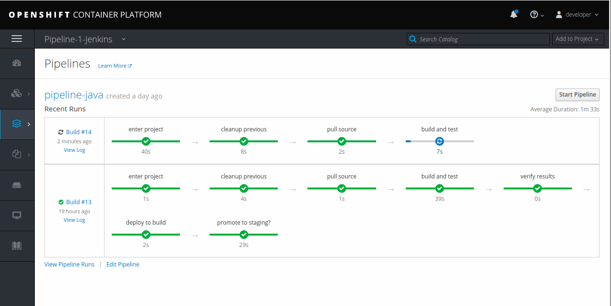

# OpenShift - CI/CD Pipeline for JWS/Tomcat
OpenShift can be a useful aide in creating a Continuous Integration (CI) / Continuous Delivery (CD) pipeline.  CI/CD is all about creating a streamlined process to move from a developer's code change to delivered operations-ready software (i.e. ready to deploy to production).  And a key part of CI/CD is the automation to make the process predicatable, repeatable, and easy.

This git repo contains an intentionally simple example of a software pipeline to deploy a webapp. And it showcases the tight intergration between Jenkins and OpenShift.  Namely the multiple plugins that enable shared auth, preform synchronization between Jenkins and OpenShift, and allow for steps to be written in a readable and comprehensive syntax.

> #### This example deploys a Java Web Application on [JBoss Web Server](https://www.redhat.com/en/technologies/jboss-middleware/web-server)/Apache Tomcat

## Why pipelines?
The most obvious benefits of CI/CD pipelines are:
* Deliver software more efficiently and rapidly
* Free up developer's time from manual build/release processes
* Standardize a process that requires testing before release
* Track the success and efficiency of releases plus gain insight into (and control over) each step

## How to put this in my cluster?
First off, you need access to an OpenShift cluster.  Don't have an OpenShift cluster?  That's OK, download the CDK for free [here](https://developers.redhat.com/products/cdk/download). The CDK can run on any linux distro, windows or mac. If you need additional documentation on the cdk, there is the upstream project, [minishift](https://www.okd.io/minishift/)

| **WARNING:** The CDK has Red Hat supported images and templates. Minishift does NOT |
| --- |

Install the templates needed for [JBoss Web Server](https://www.redhat.com/en/technologies/jboss-middleware/web-server)/Apache Tomcat

> `ocp-install-templates.sh`

Then use this script for creating all the projects and required pipeline components for this example.

 > `pipeline_setup.sh`

Because no other Jenkins server is already configured for use, OpenShift will actually create one for you.  And before starting the pipeline, wait until that jenkins server is ready.  You can see status in the webconsole or with `oc get pods`.

But we need to do one more thing because of a current limitation with the sync plugin.  We have to give Jenkins a list of OpenShift namespaces to stay in sync with.  

       Open the Jenkins webconsole
       Goto: Manage Jenkins -> Configure System -> OpenShift Jenkins Sync -> Namespace 
       Add 'pipeline-app pipeline-app-staging' to the list"

OK, now we can kick off a new pipeline build via the the web console

It will create the app in our pipeline-app project.  And once that succeeds and rollsout it will prompt us for input to determine if everything looks good to move to staging.  **Yes** = rollout to staging, **No** = fail the pipeline.

## Editing the Application

* To make edits to the application source, you will need [docker](https://www.docker.com/get-started) and [s2i](https://github.com/openshift/source-to-image) to run the same build process as on Openshift

* To build a local docker image with the s2i wrapper
> `s2i-build.sh`

* To run the built image with docker
> `s2i-run.sh`

* To deploy changes to the running container, have the following in **`~/.m2/settings.xml`**
~~~xml
<?xml version="1.0" encoding="UTF-8" ?>
<settings>
  <servers>
    <server>
      <id>webserver50</id>
      <username>tomcat</username>
      <password>tomcat</password>
    </server>
  </servers>
</settings>
~~~
Then run this script to remote deploy to the running Tomcat server
> `deploy.sh`

## About the code / software architecture
The parts in action here are:
* A sample web app
* OpenShift Jenkins [server image](https://github.com/openshift/jenkins#installation)
	- Includes the [OpenShift Jenkins client plugin](https://github.com/openshift/jenkins-client-plugin) (for newer OpenShift installs >= 3.7)
	- Includes the [OpenShift Jenkins sync plugin](https://github.com/openshift/jenkins-sync-plugin)
	- Includes the [OpenShift Jenkins auth plugin](https://github.com/openshift/jenkins-openshift-login-plugin) (for OpenShift >= 3.4)
	- Includes the [OpenShift Jenkins plugin](https://github.com/openshift/jenkins-plugin)
* OpenShift Jenkins [slave images](https://access.redhat.com/containers/#/search/jenkins%2520slave)
* A Jenkinsfile (using OpenShift DSL)
* Instant app template YAML file (to create/configure everything easily)
* Key platform components that enable this example
	- Projects and Role Based Access Control (RBAC)
	- Integration with Jenkins
	- Source code building via s2i
	- Container building via BuildConfigs
	- Deployments via image change triggers

## Other considerations
The Jenkins integration can come in a varitey of different flavors. See below for some disucssion on things to consider when doing this for your projects.
* Where does Jenkins get deployed? e.g. in each project, shared in global project, external to OpenShift
	- Openshift can autoprovision Jenkins
	- You can pre-setup Jenkins to be shared by multiple projects
	- If you've already got a Jenkins server and you just want to hook into it
* How does the pipeline move images through dev/test/prod?
	- triggers to pull?
	- project to project?
	- via tagging images?
	- via the OpenShift plugin copying/creating?
* Can everyone do anything with Jenkins or will you define roles and SCC/RoleBindinds to restrict actions?
* Where is the Jenkinsfile?
	- in git - easy to manage independently
	- embedded in an OpenShift BuildConfig template - doesn't require a git fetch, editable within OpenShift
* What OpenShift integration hooks will you use?  
	- git triggers, image change triggers, cron jobs, etc.
* Does production have a separate cluster?
	- who has the role to deploy images to production and is there an external tool?
	- e.g. Service Now, JIRA Service Desk, etc.
* Do you want to roll your own Jenkins image?
	- The images that come with OpenShift are tested to work - if you roll your own to make sure any plugins used align with the platform version
* Do you need to setenv vars for the pipeline
* Coordinating individual microservice builds and running integration tests
* Performing coverage tests
* Doing code scanning

## References and other links to check out (trying to keep these in a best-first order)
* https://github.com/openshift/jenkins-client-plugin
* https://blog.openshift.com/building-declarative-pipelines-openshift-dsl-plugin/
* https://jenkins.io/doc/book/pipeline/syntax/#declarative-pipeline
* https://docs.openshift.com/container-platform/3.11/using_images/other_images/jenkins.html
* https://docs.openshift.com/container-platform/3.11/dev_guide/dev_tutorials/openshift_pipeline.html
* https://docs.openshift.com/container-platform/3.11/install_config/configuring_pipeline_execution.html
* https://github.com/OpenShiftDemos/openshift-cd-demo

